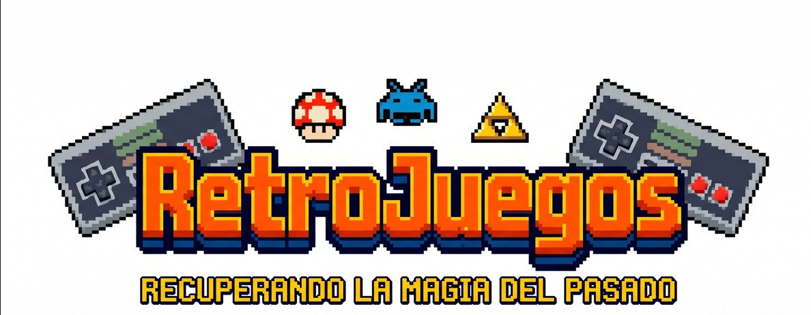

# 🕹️ RetroJuegos: Proyecto Intermodular

  

## 📝 Presentación del Proyecto
Este software nace de una necesidad real y personal: la gestión de un negocio de compra/venta de videojuegos retro que desarrollo junto a una socia. El objetivo principal es profesionalizar nuestra actividad, garantizando un registro exhaustivo de todo el flujo de producto, desde la adquisición hasta la venta final.

La aplicación no solo controla el stock físico, sino que integra la lógica financiera de nuestra sociedad. He implementado algoritmos específicos para **automatizar el cálculo de beneficios individuales**. El sistema distingue la procedencia de cada artículo (stock propio o compartido), ya que el reparto de ganancias varía según el origen, asegurando así una transparencia total en nuestras finanzas.

### 💡 Problema que resuelve
El mercado del coleccionismo a menudo se gestiona de forma caótica. **RetroJuegos** soluciona:
*   **Gestión de Sociedades**: Calcula automáticamente cuánto corresponde a cada socia basándose en la procedencia del stock.
*   **Falta de trazabilidad**: Registra quién realizó cada operación y cuándo.
*   **Control de Inventario**: Clasificación estandarizada por plataforma, género y estado de conservación.

---

## 🚀 Instalación y Puesta en Marcha (Manual)

Sigue estos pasos para configurar el proyecto en tu equipo local de forma manual.

### 📋 Requisitos Previos
*   **Java Development Kit (JDK) 24** o superior.
*   **MySQL Server 8.0** o MariaDB.
*   **IntelliJ IDEA** (recomendado).

### 🛠️ Configuración Paso a Paso

1.  **Preparación**: Descarga y extrae el proyecto en una carpeta local.
2.  **Base de Datos**: 
    *   Crea una base de datos llamada `retrojuegos` en tu gestor (Workbench/phpMyAdmin).
    *   Importa primero el archivo [**/sql/creacionTablasSQL.sql**](./sql/creacionTablasSQL.sql) para crear la estructura.
    *   Importa después el archivo [**/sql/insercionDatosSQL.sql**](./sql/insercionDatosSQL.sql) para cargar los datos iniciales.
    *   **Verificación**: Revisa las credenciales en `src/main/java/com/retrojuegos/retrojuegos/database/DBConnection.java`.
3.  **Ejecución en IntelliJ**:
    *   Abre el proyecto seleccionando el archivo `pom.xml`.
    *   Carga los cambios de Maven ("Load Maven Changes").
    *   **Lombok**: Activa el procesamiento de anotaciones en *Settings > Build > Compiler > Annotation Processors*.
    *   Ejecuta la clase `AplicacionStart.java`.

---

## 📂 Estructura del Repositorio y Vinculación Curricular

*   [**💻 /src (Código Fuente)**](./src) : Implementación de la lógica, servicios y controladores.
    *   *Asignaturas:* **Programación** y **MPO**.
    *   ⚠️ **Nota:** Consulta el [**README de MPO**](./src/README.md) dentro de esta carpeta para ver el detalle de la arquitectura y las **mejoras mediante refactorización** realizadas.
*   [**🗄️ /sql (Base de Datos)**](./sql) : Scripts de creación (`creacionTablasSQL.sql`) e inserción (`insercionDatosSQL.sql`).
    *   *Asignatura:* **Bases de Datos**.
*   [**🎨 /diagramas (Diseño Visual)**](./diagramas) : Esquemas E-R y diagramas de flujo.
    *   *Asignaturas:* **Bases de Datos** y **Entornos de Desarrollo**.
*   [**📄 /docs (Documentación Técnica)**](./docs) : Repositorio central de documentación:
    *   [**📁 Empleabilidad**](./docs/empleabilidad) : Todos los archivos requeridos para esta asignatura se encuentran en esta carpeta.
    *   [**📁 XML**](./docs/xml): Estructuras de datos e informes (Asignatura: **Lenguaje de Marcas**).
    *   [**📁 Sistemas**](./docs/sistemas): Informe técnico, manual de instalación y vídeo demostrativo (Asignatura: **Sistemas Informáticos**).

---

## 🎯 Motivación
Este es mi primer proyecto "de verdad". Me motiva transformar un hobby y un pequeño emprendimiento real en un sistema controlado que me permita aplicar cada día lo aprendido en el aula.

---
*Desarrollado por Mónica Espiñeira Aragón - 1º DAM*
